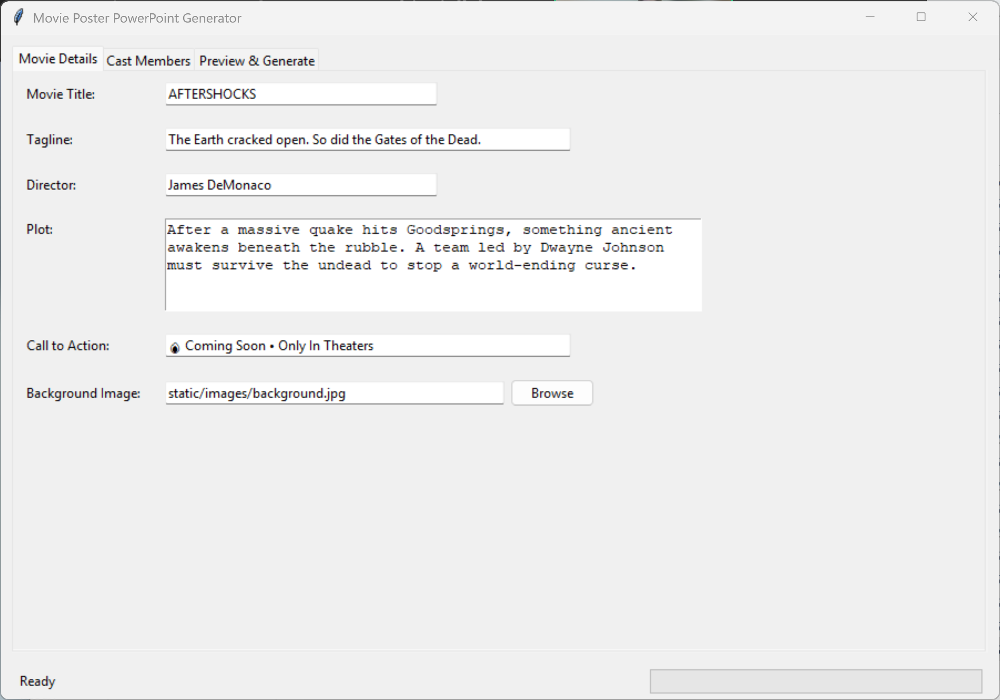
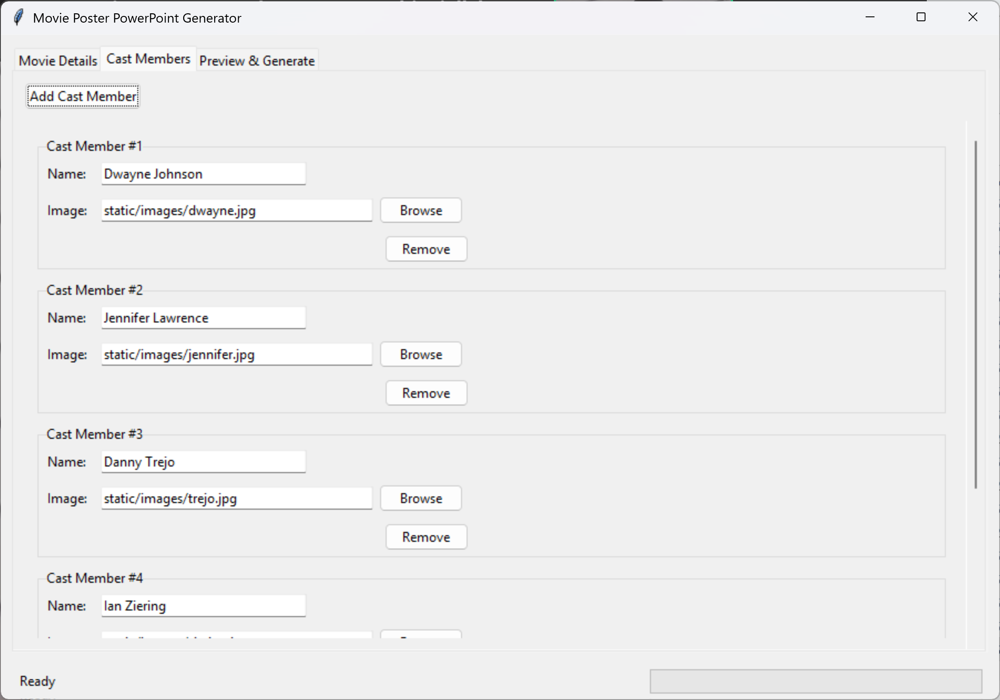
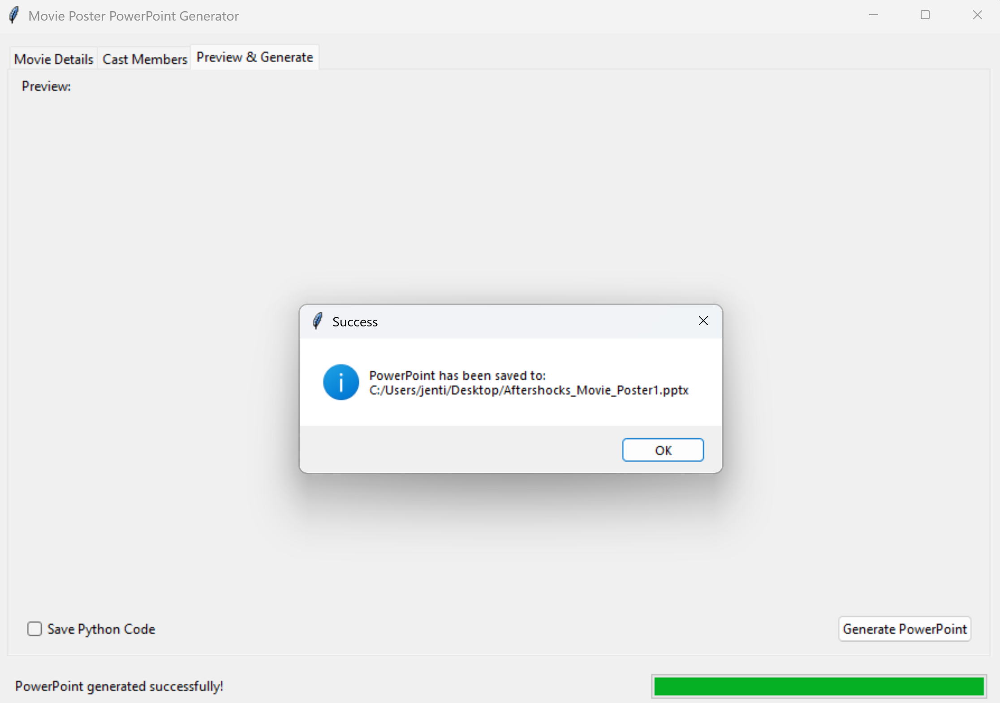
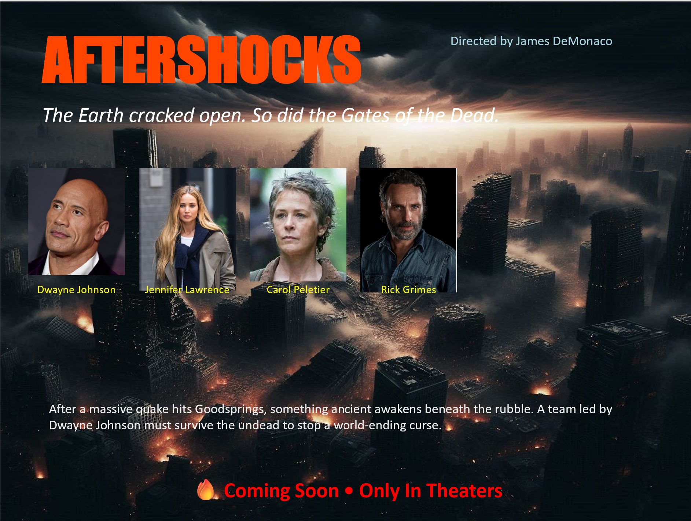

# 📽️ **PowerPoint Generator by AJ**

  
  

> ⚡ A simple, automated solution to generate polished PowerPoint presentations — ideal for reports, lectures, or data-driven storytelling.

---

## 🧾 About This Project

**PowerPoint Generator** was created to streamline the process of building structured presentations without manual slide editing. It’s ideal for professionals, educators, and students who frequently need templated slides generated from data or forms.

This project demonstrates:

* Automation using Python  
* Slide creation logic with `python-pptx`  
* Clean code modularity and user-centered design  
* File handling and visual formatting at scale  

---

## 🎓 Project Background: BHCC Academic Contribution

This project was developed as part of **PROJECT 6: ETHICAL HACKING** under the **CIT-113-01 - Info Tech Problem Solving** course at **Bunker Hill Community College (BHCC)** during the Spring 2025 semester. The course emphasizes:

- Real-world problem solving through technology  
- Ethical use of AI and digital tools  
- Project-based learning (PBL) with a focus on communication, teamwork, and user impact  
- Building digital fluency across word processing, spreadsheets, and presentation software  

> 💬 *"The goal isn’t just to code — it's to create something meaningful, solve real problems, and present ideas clearly."*

This project aligns with several core learning outcomes of the course:

- Apply automation to improve productivity and reduce repetitive tasks  
- Use Python and GUI tools for digital communication  
- Create effective digital presentations using programmatically generated media  
- Reflect on the ethical use of information and tools in problem-solving  
- Demonstrate curiosity, initiative, and independent development in a structured, collaborative learning environment  

It serves as both a technical tool and a creative expression of problem-solving — showcasing how programming can make knowledge sharing more efficient and engaging.

---

## 🔽 Download

📦 Get the latest executable:  
➡️ **[Download PowerPoint Generator v1.3 (.exe)](https://github.com/jentimanatol/PowerPointGenerator/releases/download/v1.3/PowerPointGenerator.exe)**

📁 View or fork the source:  
🔍 **[Browse all releases](https://github.com/jentimanatol/PowerPointGenerator/releases)**

---

## 🚀 Features Overview

* 🖼️ **Auto-generate slides** from user inputs or database forms  
* ✨ **Supports text formatting**, titles, and bullet points  
* 💾 **Save PowerPoint file instantly**  
* 📋 **User-friendly GUI** (optional form integration)  
* 🧠 **No PowerPoint software required to run**  

---

## 🧑‍🏫 Who Should Use This?

* 🧑‍💼 **Professionals** generating regular reports  
* 👨‍🏫 **Educators** preparing repeatable slide templates  
* 📊 **Data analysts** turning data into presentations  
* 🧪 **Researchers** who want to automate slide output from scripts  

Whether you need 5 slides or 50, this tool automates the process and helps you **stay focused on content, not formatting**.

---

## 🛠️ How It Works

1. **Launch the application**  
2. **Fill out form fields** (e.g., slide title, bullet points)  
3. **Click “Generate PowerPoint”**  
4. ✅ The app saves your `.pptx` file in seconds, formatted and ready to use.  

Bonus: You can hook it into a database or spreadsheet and extend it for bulk slide creation.

---

## 🖼️ App Preview

## 🖼️ App Preview

  

*A simple interface with powerful presentation results.*

---

## 💡 Why I Built This

I wanted to make presentation creation fast, consistent, and error-free — especially in academic or technical environments. PowerPoint Generator is built to remove repetitive tasks, enforce consistency, and let you focus on the **message, not the medium**.

It reflects my interest in:

* Automation  
* UI simplicity  
* Communication tools that scale  
* Making tech accessible for non-technical users  

---

## 🛠 Tech Stack

* `Python 3.11+`  
* `python-pptx` (for slide generation)  
* `Tkinter` (for GUI)  
* `lxml` (XML handling in .pptx)  
* `PyInstaller` (for `.exe` packaging)  

Optional:  
* `pyautogui` — for GUI enhancements or automated actions  

---

## 📃 License & Credits

🆓 **MIT License** — use, modify, and distribute freely.

👤 Created by **Anatolie Jentimir**  
🎓 Developed at **Bunker Hill Community College**  
📅 Spring 2025 – **CIT-113-01: Info Tech Problem Solving**  

> *If this tool helps you present better or faster — I’d love to know! Feel free to fork and evolve it.*
